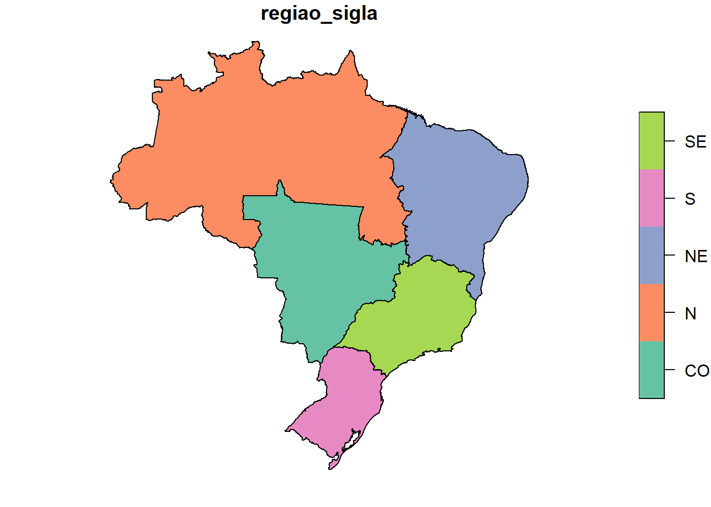

<!-- README.md is generated from README.Rmd. Please edit that file -->
brmap
=====

Polígonos de unidades territoriais do Brasil em R Simple Feature

Fontes
------

-   Limites de município e estado: <ftp://geoftp.ibge.gov.br/organizacao_do_territorio/malhas_territoriais/malhas_municipais/municipio_2017/Brasil/BR>
-   Limites de região e brasil: <ftp://geoftp.ibge.gov.br/organizacao_do_territorio/malhas_territoriais/malhas_municipais/municipio_2016/Brasil/BR/BR.zip>
-   Códigos e nomes: <https://servicodados.ibge.gov.br/api/v1/localidades/municipios>
-   Coordenadas dos municípios: <ftp://geoftp.ibge.gov.br/organizacao_do_territorio/estrutura_territorial/localidades/Shapefile_SHP/>

Instalação
----------

``` r
if (!require("devtools")) install.packages("devtools")
devtools::install_github("italocegatta/brmap")
```

Uso
---

``` r
library(tibble)
```

``` r
library(brmap)
#> Loading required package: sf
#> Warning: package 'sf' was built under R version 3.5.2
#> Linking to GEOS 3.6.1, GDAL 2.2.3, PROJ 4.9.3
```

``` r
brmap_brasil
#> Simple feature collection with 1 feature and 0 fields
#> geometry type:  POLYGON
#> dimension:      XY
#> bbox:           xmin: -73.99045 ymin: -33.75118 xmax: -34.79288 ymax: 5.271841
#> epsg (SRID):    4674
#> proj4string:    +proj=longlat +ellps=GRS80 +towgs84=0,0,0,0,0,0,0 +no_defs
#>                         geometry
#> 1 POLYGON ((-49.71257 -29.325...
```

``` r
brmap_regiao
#> Simple feature collection with 5 features and 3 fields
#> geometry type:  POLYGON
#> dimension:      XY
#> bbox:           xmin: -73.99045 ymin: -33.75118 xmax: -34.79288 ymax: 5.271841
#> epsg (SRID):    4674
#> proj4string:    +proj=longlat +ellps=GRS80 +towgs84=0,0,0,0,0,0,0 +no_defs
#> # A tibble: 5 x 4
#>   regiao_cod regiao_nome  regiao_sigla                             geometry
#>        <int> <chr>        <chr>                              <POLYGON [°]>
#> 1          1 Norte        N            ((-48.35878 -5.170085, -48.35617 -5~
#> 2          2 Nordeste     NE           ((-37.34115 -11.44234, -37.34723 -1~
#> 3          3 Sudeste      SE           ((-44.72418 -23.36753, -44.72414 -2~
#> 4          4 Sul          S            ((-49.71257 -29.32557, -49.71257 -2~
#> 5          5 Centro-Oeste CO           ((-50.51107 -12.86077, -50.51034 -1~
```

``` r
brmap_estado
#> Simple feature collection with 27 features and 4 fields
#> geometry type:  POLYGON
#> dimension:      XY
#> bbox:           xmin: -73.99045 ymin: -33.75118 xmax: -34.79288 ymax: 5.271841
#> epsg (SRID):    4674
#> proj4string:    +proj=longlat +ellps=GRS80 +towgs84=0,0,0,0,0,0,0 +no_defs
#> # A tibble: 27 x 5
#>    estado_cod regiao_cod estado_nome estado_sigla                  geometry
#>         <int>      <int> <chr>       <chr>                   <POLYGON [°]>
#>  1         11          1 Rondônia    RO           ((-62.86662 -7.975868, -~
#>  2         12          1 Acre        AC           ((-73.18253 -7.335496, -~
#>  3         13          1 Amazonas    AM           ((-67.32609 2.029714, -6~
#>  4         14          1 Roraima     RR           ((-60.20051 5.264343, -6~
#>  5         15          1 Pará        PA           ((-54.95431 2.583692, -5~
#>  6         16          1 Amapá       AP           ((-51.1797 4.000081, -51~
#>  7         17          1 Tocantins   TO           ((-48.35878 -5.170085, -~
#>  8         21          2 Maranhão    MA           ((-45.84073 -1.045485, -~
#>  9         22          2 Piauí       PI           ((-41.74605 -2.803497, -~
#> 10         23          2 Ceará       CE           ((-40.49717 -2.784509, -~
#> # ... with 17 more rows
```

``` r
brmap_municipio
#> Simple feature collection with 5569 features and 6 fields
#> geometry type:  GEOMETRY
#> dimension:      XY
#> bbox:           xmin: -73.99045 ymin: -33.75118 xmax: -34.79288 ymax: 5.271841
#> epsg (SRID):    4674
#> proj4string:    +proj=longlat +ellps=GRS80 +towgs84=0,0,0,0,0,0,0 +no_defs
#> # A tibble: 5,569 x 7
#>    municipio_cod estado_cod municipio_nome   lon    lat   alt
#>            <int>      <int> <chr>          <dbl>  <dbl> <dbl>
#>  1       1100015         11 Alta Floresta~ -62.0 -11.9   338.
#>  2       1100023         11 Ariquemes      -63.0  -9.91  139.
#>  3       1100031         11 Cabixi         -60.5 -13.5   236.
#>  4       1100049         11 Cacoal         -61.4 -11.4   177.
#>  5       1100056         11 Cerejeiras     -60.8 -13.2   263.
#>  6       1100064         11 Colorado do O~ -60.6 -13.1   419.
#>  7       1100072         11 Corumbiara     -60.9 -13.0   269.
#>  8       1100080         11 Costa Marques  -64.2 -12.4   145.
#>  9       1100098         11 Espigão D'Oes~ -61.0 -11.5   263.
#> 10       1100106         11 Guajará-Mirim  -65.3 -10.8   133.
#> # ... with 5,559 more rows, and 1 more variable: geometry <POLYGON [°]>
```

Cada objeto tem uma versão simplificada, onde foi mantido apenas 10% dos vertices, com o objetivo de deixar a renderização dos mapa mais rápida.

``` r
pryr::object_size(brmap_municipio)
#> 149 MB
pryr::object_size(brmap_municipio_simples)
#> 18.3 MB
```

``` r
plot(brmap_regiao_simples["regiao_sigla"])
```


